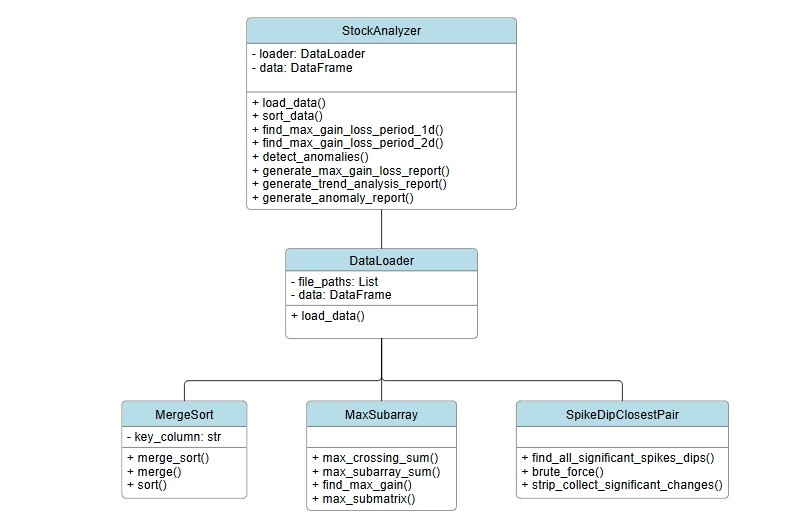
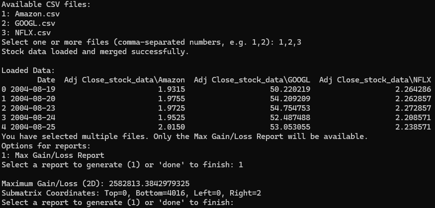
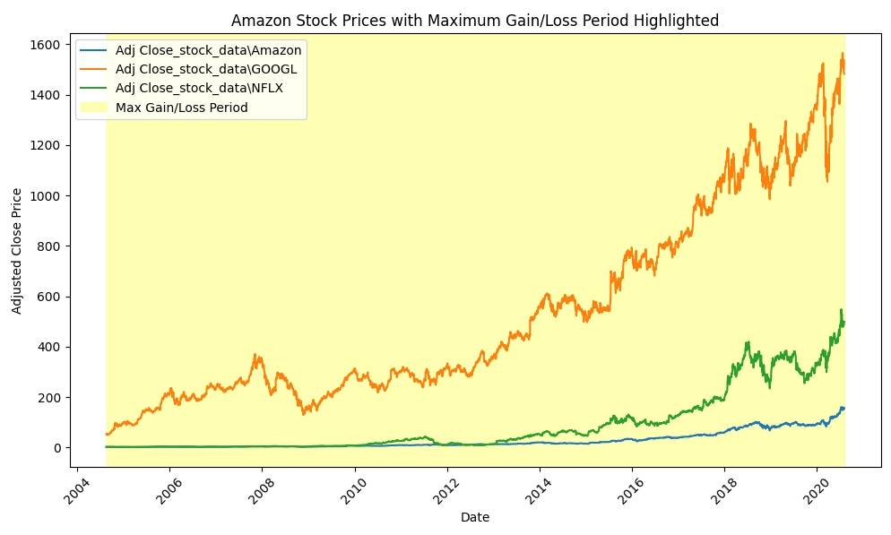
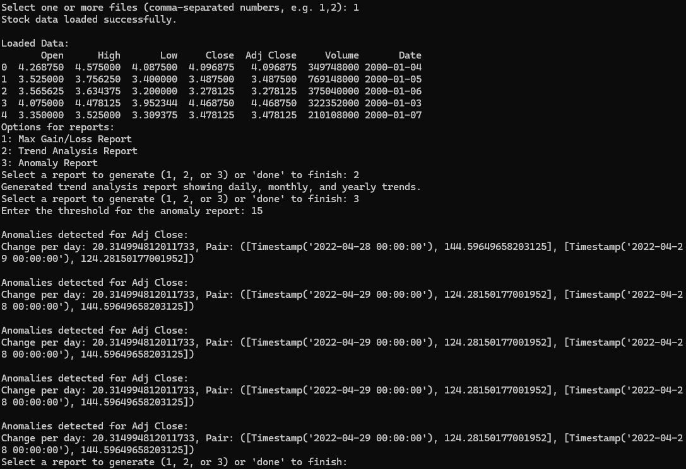
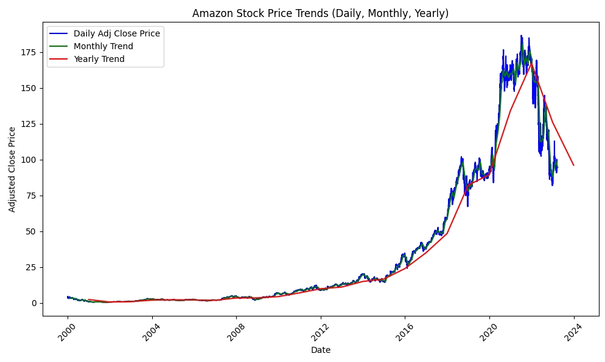
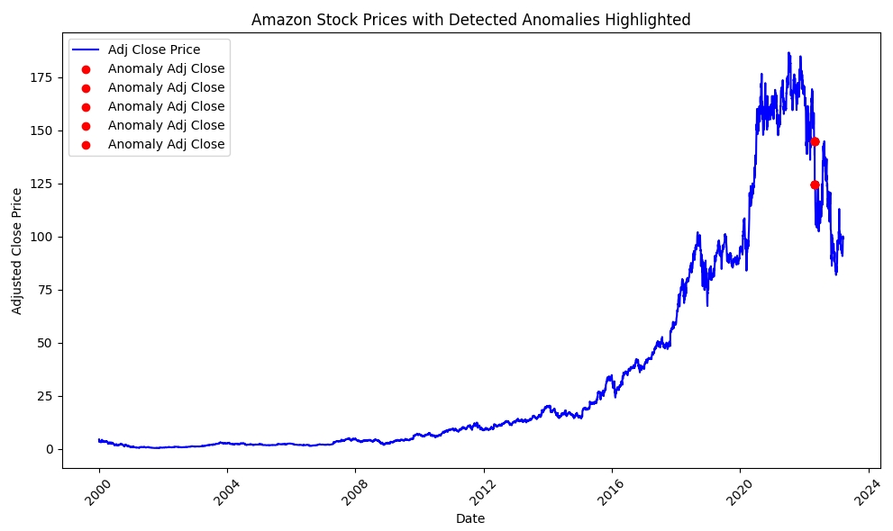
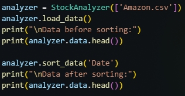
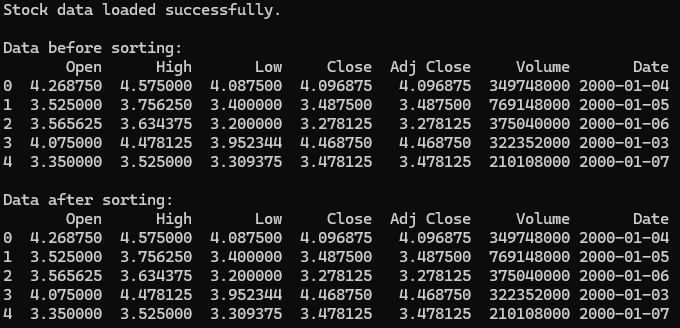
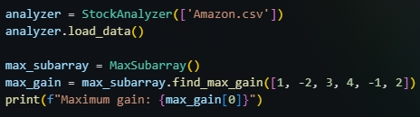

# Stock Analyzer

## Description of the Project

The **Stock Analyzer** is a Python-based application designed to analyze financial datasets, specifically stock prices, to derive insights and detect anomalies. The primary goal of this project is to provide a tool to visualize stock trends, identify significant price changes, and detect unusual price movements.

### Problem Addressed

In the volatile world of finance, analyzing stock price movements is crucial for informed decision-making. Investors often struggle to identify meaningful patterns and anomalies that could indicate potential investment opportunities or risks.

### Goals of the Analysis

-   To visualize stock price trends over time.
-   To identify periods of maximum gain and loss in stock prices.
-   To detect anomalies in stock price movements that could indicate market inefficiencies or potential investment opportunities.

### Type-Specific Considerations

This project leverages historical stock price datasets, typically in CSV format, which include essential columns such as `Date` and `Adj Close`. The algorithms employed for processing and analysis include:

-   **Merge Sort**: For sorting the datasets efficiently.
-   **Divide and Conquer Techniques**: Used in the `MaxSubarray` class to find maximum gains and losses in both 1D and 2D stock data.
-   **Spike and Dip Detection Algorithms**: For identifying significant anomalies in stock price movements.

## Structure of the Code

The project is organized into several classes, each responsible for a specific functionality. The following block diagram illustrates the overall structure of the implementation:


### Class Summaries

-   **DataLoader**

    -   **Purpose**: Loads financial data from CSV files and merges them based on the `Date` column.
    -   **Key Methods**: `load_data()`

-   **StockAnalyzer**

    -   **Purpose**: Analyzes stock data for trends, anomalies, and maximum gains/losses.
    -   **Key Methods**: `generate_anomaly_report()`, `generate_trend_analysis_report()`, `generate_max_gain_loss_report()`

-   **MaxSubarray**

    -   **Purpose**: Implements algorithms to find maximum gains/losses in stock price data.
    -   **Key Methods**: `max_submatrix()`, `find_max_gain()`

-   **MergeSort**

    -   **Purpose**: Provides sorting functionality for data manipulation.
    -   **Key Methods**: `sort()`

-   **SpikeDip**
    -   **Purpose**: Detects significant spikes and dips in stock price data.
    -   **Key Methods**: `find_all_significant_spikes_dips()`

## Instructions on How to Use the System

1. **Clone the Repository**:

```bash
    git clone https://github.com/yourusername/stock-analyzer.git
    cd stock-analyzer
```

2. **Install Required Packages:** Ensure you have Python 3 and install the necessary packages:

```bash
   pip install pandas matplotlib
```

3. **Run the Application:**

-   Execute the main Python script:

```bash
    python main.py
```

4. **Load Data:** The application will prompt you to select CSV files from your current directory.
5. **Choose Reports:** Based on the number of files selected, you will have options to generate different reports:

-   If one file is selected, you can generate anomaly reports, trend analysis reports, and max gain/loss reports.
-   If multiple files are selected, only the max gain/loss report will be available.

6. **Set Parameters:** For anomaly detection reports, specify the threshold for significant price changes when prompted.

## Verification of Code Functionality

### Example Execution

-   Here’s a sample of what executing the application looks like:
    
    -   Output after generating maximum gains report:
        
-   Here's another example where trend and anomalies reports are generated based on the Amazon stock data:
    
    -   Output after generating reports:
        
        

### Verification of Component Algorithms with Toy Examples

-   **Merge Sort Example:** For an input of the first 5 rows of Amazon data where 4th row is not within the correct place, running merge sort algorithm with 'Date' as a key column will correctly sort the rows. Below is the verification:
    -   Code: 
    -   Result: 
-   **MaxSubarray Example:** For an input array [1, -2, 3, 4, -1, 2], the algorithm correctly identifies a maximum gain of 6. Below is the verification:
    -   Code: 
    -   Result: 
-   **Spike Detection Example:** Given prices [100, 105, 110, 100, 95, 120] and a threshold of 10, the algorithm detects spikes at the transitions between 100 and 120.

## Discussion of Findings

### Insights Gained

The analysis revealed several significant trends and anomalies in the stock data, highlighting how certain events in the market affect stock prices.

### Challenges Faced

Some challenges included:

-   Ensuring the accuracy of anomaly detection algorithms.
-   Handling missing data in the CSV files.

### Limitations

-   The system currently only supports CSV files with specific column formats.
-   More sophisticated anomaly detection techniques could be integrated for better accuracy.

### Suggestions for Improvement

-   Expand support for other data formats (e.g., JSON).
-   Enhance visualization capabilities with more interactive graphs.
-   Implement machine learning models to predict stock price movements based on historical data.
